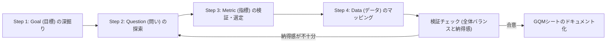

# GQM Helper (探索特化型)

測定の形骸化を防ぎ、真に意味のある「納得感のあるメトリクス」を探索・策定するためのガイドライン。

測定そのものが目的になってはならず、そこから得られる洞察と行動にこそ価値がある。
このスキルは、エージェントがユーザーと共に対話を通じて本質的な問いと指標を「探索」するためのものである。

## 探索ワークフロー (GQMD アプローチ)

エージェントは、『Software Architecture Metrics』でも提唱されている **GQMD（Goal-Question-Metric-Data）** アプローチを用い、以下の4ステップをユーザーと対話しながら進める。
各ステップでは、エージェントは単にツリーを埋めるのではなく、「探索」をリードすること。

### Step 1: Goal (目標) の深掘り

まず、測定の「対象」「目的」「視点」「環境」を明らかにし、測定を行う背景にある真の課題感を掘り下げる。

- **対象 (Object)**: 何を対象とするか？ (例: ソースコード、テストプロセス、デリバリーフロー)
- **目的 (Purpose)**: なぜ測定したいのか？ (例: 現状の把握、ボトルネックの改善、品質の保証)
- **視点 (Perspective)**: 誰の立場での評価か？ (例: 開発チーム、プロダクトオーナー、エンドユーザー)
- **環境 (Context)**: どのような制約や状況下か？ (例: このチームの今スプリント、レガシー移行期)

#### 【所作の規律：Goalの深掘り】

- **手段への飛びつきの禁止**: ユーザーから「カバレッジを測定したい」といった具体的な手段の提示があったとしても、すぐに飛びつかないこと。まずは「なぜそれを知りたいのか」を問いかけ、Goalを確立する。
- **Goalの要約**: Goal Statementは、4つの要素を元にしつつ、長くなりすぎないようにシンプルに要約すること。具体的なフェーズ名や解決策を入れすぎるとメトリクス選定の余地がなくなるため、適切な抽象度を保つこと。

### Step 2: Question (問い) の探索

Goalを達成したか、あるいは現状がどうなっているかを判断するために、「何が分かればいいのか」という問いを探索する。

- **仮説の洗い出し**: 現状、何が問題だと感じているか？
- **判断基準の定義**: 目標が達成されたと自信を持って言える状態とは、どのような状態か？

#### 【所作の規律：Questionの探索】

- **先走りの禁止**: 一度に多くの「問い」や「解決策」を提示してユーザーに選ばせるのではなく、ユーザーの課題感を聞きながら、対話を通じて1つずつ問いを紡ぎ出すこと。
- **問いの明確化**: 質問の表現は曖昧な「〜の関係」などではなく、簡潔かつ明確な「問い」の形（「〜は〜に影響しているか？」など）で出力すること。

### Step 3: Metric (指標) の検証と選定

各Questionに答えるためのメトリクスを探索する。定量的（数値で測れるもの）だけでなく、定性的（アンケートや主観評価）なアプローチも視野に入れる。

- **アライメント**: メトリクスの値が「改善」したとき、本当にQuestionに対する良い答えになるか？

#### 【所作の規律：Metricの選定】

- **データとの混同の禁止**: メトリクス（指標）とデータ（具体的な取得値・ソース）を混同しないこと。
  メトリクスは「最初のレビューまでの時間」という測定の基準（概念）であり、データはそれを計算するための具体的な値（タイムスタンプなど）である。
- **メトリクスは再利用可能**: 質問とメトリクスは1対1である必要はない。
  1つの質問に対して複数のメトリクスがあってもよく、同じメトリクスが複数の質問に対応してもよい（1対多、多対多の関連性を許容する）。
- **適応度関数（自動チェック）と監視メトリクスの区別**: ESLintや適応度関数で強制的に防ぐべきルール違反は、「メトリクス」として収集・可視化する必要はない。
  自動テストとして組み込み、ゲートキーパーで弾くアプローチを優先すること。
  メトリクスとして監視すべきは、自動では強制しづらい「時間経過による変化や傾向」である。

### Step 4: Data (データ) のマッピング

各Metricを算出するために、「具体的にどのデータソースから、どのような値を取得するか」を定義する。

- **測定可能性・収集コスト**: そのデータは今、または現実的なコストで収集可能か？
  - 例: GitHub APIの `created_at` と `first_review_at` のタイムスタンプ差分、など

## 補助リファレンスとテンプレート

探索を効率的かつ効果的に進めるために、以下の詳細なテンプレートを参照すること。
コンテキストウィンドウをクリーンに保つため、必要な時のみ読み込むこと。

- [inquiry-templates.md](./references/inquiry-templates.md): 探索を深めるための問いかけテンプレート。
- [output-templates.md](./references/output-templates.md): 合意したGQMDツリーのドキュメント化用テンプレート。
