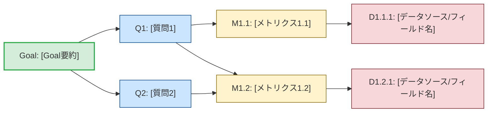

# GQM シート アウトプットテンプレート

合意したGQMD（Goal-Question-Metric-Data）ツリーは、以下のフォーマットでドキュメント化してユーザーに提示する。
Mermaid図は視認性のために `graph LR`（左右方向）を使用する。

````markdown
# GQM シート: [テーマ/プロジェクト名]

## 1. Goal (目標)

- **対象 (Object)**:
- **目的 (Purpose)**:
- **視点 (Perspective)**:
- **環境 (Context)**:

> **Goal Statement**:
> 「[Goal Statementの要約（シンプルに）]」

## 2. 探索の背景と納得したポイント

- **課題感・背景**: (なぜこの測定を行うのか、対話で明らかになったこと)
- **合意した納得のポイント**: (なぜこのメトリクスやカウンターバランスが意味を持つと判断したか)

## 3. GQM ツリー構造 (Mermaid)



## 4. メトリクスとデータ定義

- **M1.1: <メトリクス1.1>**
  - **Data**: <D1.1.1>
  - **収集方法 / 頻度**: <自動/手動>, <頻度>
- **M1.2: <メトリクス1.2>**
  - **Data**: <D1.2.1>
  - **収集方法 / 頻度**: <自動/手動>, <頻度>
````
