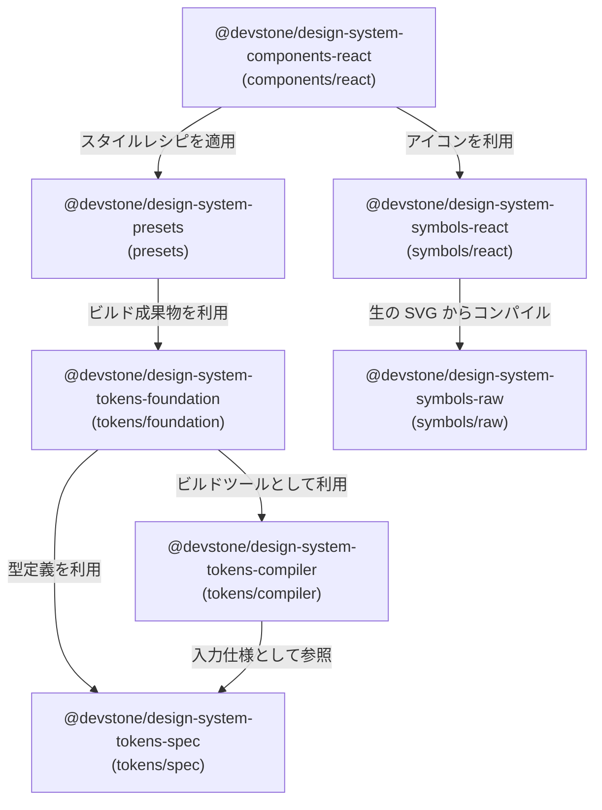
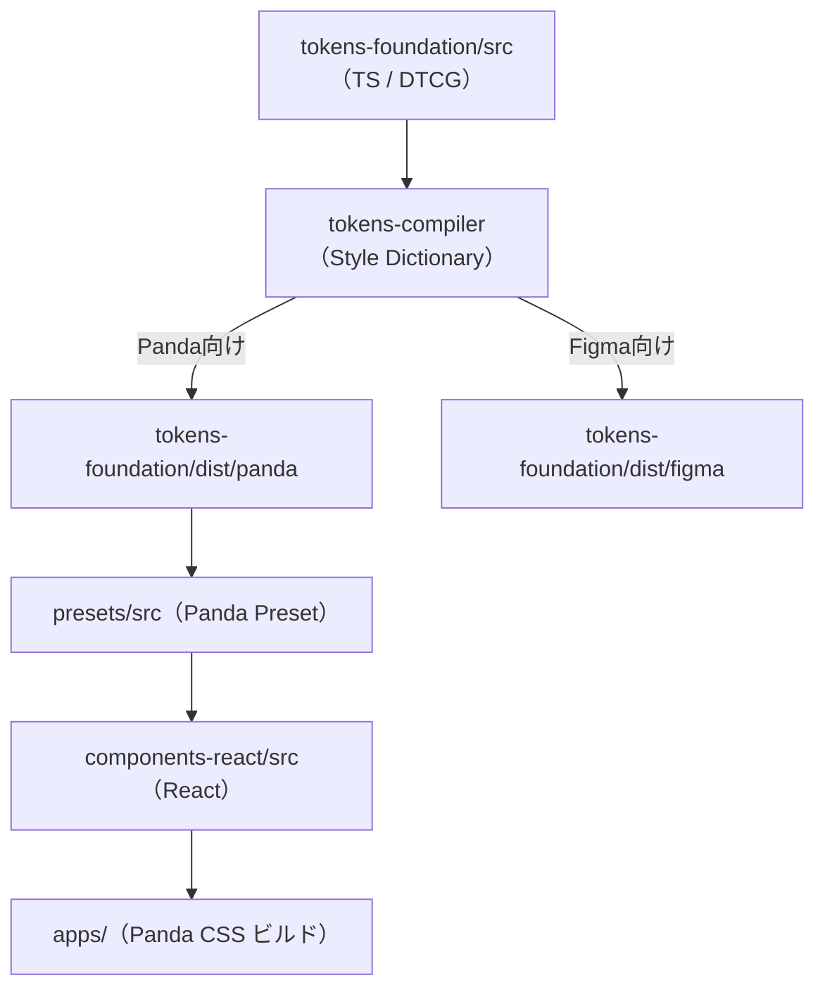

# Design System

Panda CSS と Ark UI をベースにした、プロジェクト共通のデザインシステムリポジトリです。

## 💡 設計思想

1. **Code as SSoT (真実の単一ソース)**
   デザイントークンは Figma 等の外部ツールではなく、TypeScript コード（W3C DTCG 準拠）を一次ソース（SSoT）として管理します。
2. **関心の分離とクリーンアーキテクチャ**
   「型仕様」「変換エンジン（コンパイラ）」「具体的なトークン値」「アセット」「スタイル定義」「コンポーネント」をパッケージ境界で明確に分離し、依存関係をクリーンに保ちます。
3. **一方向の依存関係**
   循環参照を排除し、上流（型・値）から下流（UIコンポーネント）へ一方向へ依存が流れるように設計されています。

---

## 📐 パッケージ構成と役割

`packages/design-system/` 配下は、以下のように整理されています。

| ディレクトリ        | パッケージ名                                | 役割・責務                                                        |
| :------------------ | :------------------------------------------ | :---------------------------------------------------------------- |
| `tokens/spec`       | `@devstone/design-system-tokens-spec`       | W3C DTCG 仕様を TypeScript で表現した純粋な「型定義（スキーマ）」 |
| `tokens/compiler`   | `@devstone/design-system-tokens-compiler`   | Style Dictionary v4 をラップした、トークン変換用ビルドエンジン    |
| `tokens/foundation` | `@devstone/design-system-tokens-foundation` | 具体的な色や余白などの値を定義するパッケージ（SSoT）              |
| `symbols/raw`       | `@devstone/design-system-symbols-raw`       | Figma 等からエクスポートされた生の SVG アセットを管理する         |
| `symbols/react`     | `@devstone/design-system-symbols-react`     | 生の SVG からコンパイルされた React 用アイコンコンポーネント群    |
| `presets`           | `@devstone/design-system-presets`           | `tokens-foundation` の出力から生成する Panda CSS プリセット       |
| `components/react`  | `@devstone/design-system-components-react`  | Ark UI と `presets` を結合した完成版 React UI コンポーネント群    |

---

## 🔗 パッケージ依存関係

---

## 🔄 データの流れ

